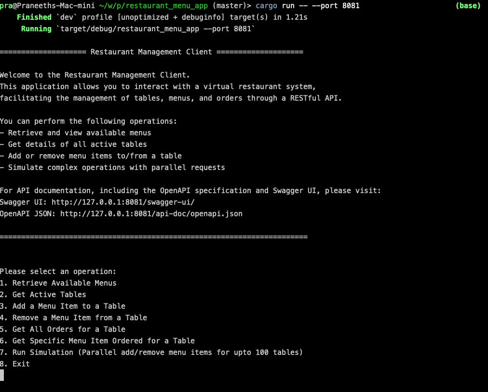

# Restaurant Menu Application

## Introduction
The Restaurant Menu Application is designed to handle and process menu orders from restaurant staff. Each order is associated with a specific table and a randomly assigned cooking time. The application stores and manages these orders, providing functionality to add, remove, and query them. It consists of two components: a client (which is executed in the main entry point of the application) and a server. When the application runs, the client starts the server in a separate thread. The client then communicates with the server via REST APIs, based on user input.

## Prerequisites
To run the application, you will need the following installed:
- [Rust](https://www.rust-lang.org/tools/install) (rustc 1.79.0)
- Cargo (which is included with Rust when installed using the above link)

## Running the Application
1. Clone this repository.
2. Navigate to the project directory:
   ```bash
   cd restaurant_menu_app
   ```
3. Build and run the application using Cargo:
   ```bash
   cargo build
   cargo run -- --port 8081
   ```

   If port 8081 is already in use, you can specify a different port:
   ```bash
   cargo run -- --port <port_number>
   ```

## Running the Tests
The application includes basic unit tests and some integration tests, although not all edge cases are covered. To run the tests, use:
```bash
cargo test
```

## API Documentation (Swagger)
1. Start the application.
2. Open the Swagger UI to view the API documentation:
   ```url
   http://localhost:<port_number>/swagger-ui/
   ```
Replace `<port_number>` with the port number specified when running the application.

## Rust Documentation
To generate and view the Rust documentation for the project, run:
```bash
cargo doc --open
```

## Provided APIs
The following APIs are exposed by the server, which is initiated when the application runs:

- `POST /api/v1/add_item/{table_id}/{item_id}` - Add a menu item to a table
- `DELETE /api/v1/remove_item/{table_id}/{item_id}` - Remove a menu item from a table
- `GET /api/v1/get_items/{table_id}` - Retrieve all menu items for a specific table
- `GET /api/v1/get_item/{table_id}/{item_id}` - Retrieve details of a specific menu item from a table
- `GET /api/v1/tables` - Get a list of available tables in the restaurant
- `GET /api/v1/menus` - Get a list of available menu items in the restaurant

These APIs can be tested via the Swagger UI at the following URL while the application is running:
```
http://localhost:<port_number>/swagger-ui/
```
Replace `<port_number>` with the port number specified when the application was started.


## Example Usage
When you run the application, the client will display the following options in the console:
```
1. Retrieve Available Menus 
2. Get Active Tables 
3. Add a Menu Item to a Table 
4. Remove a Menu Item from a Table 
5. Get All Orders for a Table
6. Get Specific Menu Item Ordered for a Table
7. Run Simulation (Parallel add/remove menu items for up to 100 tables)
8. Exit
```

Based on your selection, further input will be requested, and the client will make REST API calls to the server, displaying the results.

The **simulation** option allows you to simulate adding menu items to tables and removing them concurrently. It performs the following actions:

1. **Select Tables for Simulation**: Randomly selects number of tables (amount specified by the user, upto 100).
2. **Simultaneous Add and Remove Operations**: Adds and removes menu items in parallel, ensuring that only added items are removed.
3. **Retain Some Items**: Randomly selects some items to remain on the table after the simulation.
4. **Final Status Printing**: Prints the final state of each table in parallel.

✳︎ **The client expect all user inputs to be positive integer values.**

✳︎ **When using option 3,4,5,6 you should specify a valid menu item id and a table id, thus before using those options use option 1 and 2 to get available menus and tables**



## Current Limitations of the Application
- Cooking times for menu items are generated between 5-15 minutes during menu initialization and remain constant afterward.
    - It is assumed that cooking times are fixed for each menu item, so the time is assigned when the menu is initialized, rather than when an order is placed.
- To keep the API simple, the current design does not support bulk addition or deletion of menu items for a table.
- Table and menu availability should be managed by the restaurant, not the client. When creating an order, the client must reference menu item IDs and table IDs provided by the restaurant.
- Available menu items and tables are implemented as static, fixed sets of values.
- Ordered menu items per table, along with related data, are stored in memory for simplicity.
- The same menu item can be added multiple times to a table (a more robust solution might include an amount field).
- The application supports a maximum of 100 tables.
- Unit and integration tests for the server are realtively simple and do not cover all possible cases.
- Have not implemented tests and input validatoin for the client code.

## Some Further Considerations for Production (Server-Side)
- **Security**: Implement proper authentication and authorization mechanisms to ensure only authorized personnel can access the APIs.
- **Data Validation**: Implement more thorough input data validation.
- **Data Encryption**: Use HTTPS for secure data transmission.
- **CI/CD Integration**: Incorporate the application into a CI/CD pipeline.
- **Database**: Use a database to store data instead of in-memory storage.
- **Logging**: Add detailed logging to monitor requests and responses.
- **Rate Limiting**: Implement rate limiting to prevent system abuse.
- **Pagination**: Introduce pagination for querying menu items added to a table (though this might not be necessary in the current use case due to the limited number of menu items per table).
